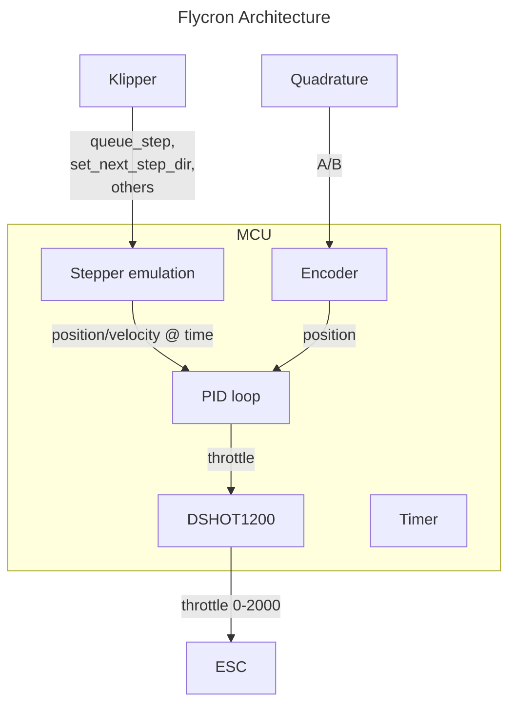

# Flycron controller

## Running

```console
% % DEFMT_LOG=info cargo run --release
   Compiling flycron v0.1.0 (/home/dalegaard/armchair/flycron)
    Finished release [optimized + debuginfo] target(s) in 1.93s
     Running `probe-rs run --chip STM32F411CEUx thumbv7em-none-eabihf/release/flycron`
      Erasing ✔ [00:00:00] [####################################################################] 32.00 KiB/32.00 KiB @ 44.95 KiB/s (eta 0s )
  Programming ✔ [00:00:00] [####################################################################] 31.00 KiB/31.00 KiB @ 33.58 KiB/s (eta 0s )    Finished in 1.658s
0 INFO  init
└─ flycron::app::init @ /home/dalegaard/armchair/flycron/src/main.rs:36
```

## Architecture

The overall system architeture is the following:



The MCU system is implemented in Rust using the RTICv2 firmware. It runs on an STM32F411CEU, hosted on the Black Pill board.

The PID loop runs at a set frequency of X kHz. This frequency is deterministic.

### Encoder

The encoder uses the native quadrature encoder input mode found on the STM32F4. The TIM5 timer peripheral is used for this purpose. The current encoder position can be found on this.

### Stepper emulation

To interoperate with Klipper, a stepper emulation layer exists. It takes `queue_step`, `set_next_step_dir`, and other stepper related commands and performs MCU side integration of the step commands. This makes it easy to calculate the target machine position at any point in time. Because the PID evalulation timesteps are deterministic with respect to the system clock, it is easy to add steps together and sample at the correct timestamps.

Of note are the format of `queue_step` commands:

```
queue_step interval= count= add=
```

Such a command is evaluated in pseudo code as:

```
last_step_time = 0
for each command:
  for i in 0..count:
    next_step_time = last_step_time + command.interval
    command.interval += add
    wait until next_step_time
    perform step
    last_step_time = next_step_time
```

Closed-form formulas can be found that will make it possible to evaluate:

- how many steps to take to get to a specific point in time
- how much time the total command will take to run
  These forms can be used to avoid the need for inefficiently running through the above for every step.

### PID loop

The PID loop runs at a constant update rate. It samples the encoder position timer and grabs the relevant position/velocity targets from the stepper emulation. It then calculates an error term and uses a PID controller to calculate a target throttle.

### DSHOT1200

Every update of the PID loop results in a throttle command. This is given to the DSHOT1200 module, which will send it to the ESC. DSHOT{150,300,600,1200} can all be implemented with the same code using any 16 bit timer with DMA support. A good choice would likely be TIM3.
